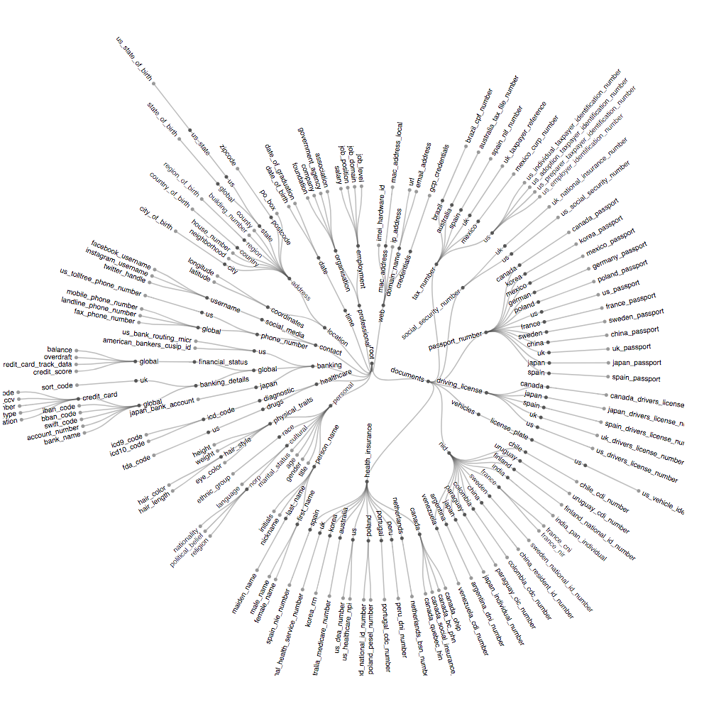

# HAZY

Welcome to hazy's public resources repository! In this repository, we aim to provide, in a centralised fashion, a set of open-sources resources that the hazy team has produced and believe could be of use the both the data-science community as well as the general.

Our hope is that by providing such resources, we can help speed up the developement of privacy-aware technologies and help ease the process of understanding the solutions we will be providing from now on.

Currently, this repository contains the following resources:
* Hazy's white paper on anonymisation
* Hazy's entity hierarchy structure
  * Interactive Visual Representation of the Hierarchy
  * YAML file containing the hierarchy.

## Entity Hierarchy



In order to understand the similarity and proximity between various entities our system detect and process, our team built a hierarchical representation of all the entities we are managing.

This has the advantage of allowing us to evaluate the relationship between any two entities or types of information in a meaningful way.

Bear in mind that such a hierarchy is still under development and will likely be updated in the up-coming months. If you have any update or feed-back on our current work that you would like to see feel free to let us know.

In order to display this hierarchy directly in your browser, type the following in terminal:

```
  bash show_hierarchy.sh
```
once done please type `ctr + c` in your terminal in order to stop the process.
